````md
# 🛡️ VelocityGate

### Stop AI Agents & Scrapers Dead in Their Tracks
**High-performance, drop-in middleware for Spring Boot 3.x that blocks malicious bot traffic before it hits your business logic.**

[](LICENSE)
[](https://spring.io/projects/spring-boot)
[]()

---

## 🚨 The Problem

AI agents, scrapers, and headless browsers are hammering your APIs.

- They burn your LLM tokens & API credits  
- They scrape your proprietary data  
- They slow down your database for real users  

You need a firewall that sits **in front of your application logic**.

---

## 🚀 The Solution: VelocityGate

VelocityGate is a **zero-configuration Spring Boot Starter** that acts as an **AI Firewall**, intercepting requests at the servlet filter level (`Ordered.HIGHEST_PRECEDENCE`).

### ✨ Key Features

- ⚡ Zero latency (in-memory, lock-efficient design)
- 🤖 Headless browser detection (Puppeteer, Selenium, Playwright)
- ⏱️ Velocity limiting (default: >50 req/sec per IP)
- 🔌 Plug & Play (no Redis, no database)

---

## 📦 Installation

> ⚠️ Currently in Beta

### Step 1: Build Locally

```bash
git clone https://github.com/YOUR_USERNAME/velocity-gate.git
cd velocity-gate
./gradlew publishToMavenLocal
````

### Step 2: Add the Dependency

#### Maven (`pom.xml`)

```xml
<dependency>
    <groupId>com.velocitygate</groupId>
    <artifactId>velocity-gate</artifactId>
    <version>1.0.0</version>
</dependency>
```

#### Gradle (`build.gradle`)

```groovy
repositories {
    mavenLocal()
    mavenCentral()
}

dependencies {
    implementation 'com.velocitygate:velocity-gate:1.0.0'
}
```

---

## ⚙️ Configuration

VelocityGate works out-of-the-box with sensible defaults.

Override in `application.properties`:

```properties
# Enable or disable the firewall (default: true)
velocitygate.enabled=true

# (Planned V1.1) Max requests per second per IP
# velocitygate.limit=50
```

---

## 🏗️ Architecture

VelocityGate injects a `BotBouncerFilter` with `Ordered.HIGHEST_PRECEDENCE`.

This ensures it runs before:

* Authentication
* Logging
* Business logic
* Controllers

### Request Flow

```mermaid
sequenceDiagram
    participant Client
    participant VelocityGate as 🛡️ BotBouncerFilter
    participant App as ⚙️ Controller
    
    Client->>VelocityGate: HTTP Request
    
    alt Malicious or High Velocity
        VelocityGate-->>Client: 403 Forbidden
    else Safe
        VelocityGate->>App: Forward Request
        App-->>Client: 200 OK
    end
```



---

## 🚦 Performance

**Memory Footprint:**
Uses a sliding window algorithm to evict stale IP records every 5 seconds.

**Concurrency:**
Thread-safe via:

* `ConcurrentHashMap`
* Atomic counters
* `ReentrantReadWriteLock`

Optimized for high-concurrency environments.

---

## 🤝 Contributing

Contributions are welcome!

1. Fork the repository
2. Create a feature branch

   ```bash
   git checkout -b feature/amazing-feature
   ```
3. Commit changes

   ```bash
   git commit -m "Add amazing feature"
   ```
4. Push branch

   ```bash
   git push origin feature/amazing-feature
   ```
5. Open a Pull Request

See `CONTRIBUTING.md` for details.

---

## 📄 License

Distributed under the Apache 2.0 License.
See `LICENSE` for more information.

```

---

### Why This Structure Is Correct

- `#` → Project title  
- `##` → Major sections  
- `###` → Subsections (like Step 1, Step 2)  
- `####` → Maven/Gradle breakdown  

This keeps GitHub’s sidebar navigation clean and professional.

If you'd like, I can now:

- Make it **enterprise-grade polished**
- Or make it **more product/marketing focused**
- Or restructure it to match top 1% GitHub open-source READMEs** 🚀
```
