# 🛡️ VelocityGate

### Stop AI Agents & Scrapers Dead in Their Tracks

**VelocityGate** is a high-performance, drop-in Spring Boot 3.x starter that blocks malicious bots, AI agents, scrapers, and high-velocity traffic *before* they reach your business logic.

[](LICENSE)
[](https://spring.io/projects/spring-boot)
[]()

---

## 🚨 The Problem

Modern APIs are constantly targeted by:

- 🤖 AI agents consuming expensive LLM tokens  
- 🕷️ Scrapers extracting proprietary data  
- ⚡ Headless browsers generating high request velocity  
- 📉 Traffic spikes degrading real user experience  

Traditional rate limiting often runs too late (inside business logic), requires external infrastructure (Redis), or adds operational complexity.

You need protection at the **edge of your application**.

---

## 🚀 The Solution: VelocityGate

VelocityGate is a **zero-configuration Spring Boot Starter** that acts as an **AI Firewall**.

It installs a servlet filter at `Ordered.HIGHEST_PRECEDENCE`, ensuring malicious traffic is blocked **before authentication, logging, security filters, or controllers execute**.

### ✨ Key Features

- ⚡ **Ultra Low Latency** — In-memory, lock-efficient design  
- 🤖 **Headless Browser Detection** — Blocks Puppeteer, Selenium, Playwright, and common AI user agents  
- ⏱️ **Velocity Limiting** — Automatically blocks IPs exceeding human-like request patterns (default: >50 req/sec)  
- 🔌 **Plug & Play** — No Redis. No database. No external systems  
- 🧵 **Thread-Safe by Design** — Built using `ConcurrentHashMap`, atomic counters, and fine-grained locking  

---

## 📦 Installation

VelocityGate is distributed via **JitPack**.

---

### 🟢 Gradle Setup

#### Step 1: Add the JitPack repository

Add this to your root `build.gradle` (or `settings.gradle`):

```groovy
dependencyResolutionManagement {
    repositoriesMode.set(RepositoriesMode.FAIL_ON_PROJECT_REPOS)
    repositories {
        mavenCentral()
        maven { url '[https://jitpack.io](https://jitpack.io)' }
    }
}
```

#### Step 2: Add the Dependency

```groovy
dependencies {
    implementation 'com.github.ashutosh-stark:velocity-gate:v1.0.0'
}
```

Refresh your Gradle project:

```bash
./gradlew build
```

---

### 🔵 Maven Setup

#### Step 1: Add the JitPack repository

Add this inside `<repositories>` in your `pom.xml`:

```xml
<repositories>
    <repository>
        <id>jitpack.io</id>
        <url>https://jitpack.io</url>
    </repository>
</repositories>
```

#### Step 2: Add the Dependency

```xml
<dependency>
    <groupId>com.github.ashutosh-stark</groupId>
    <artifactId>velocity-gate</artifactId>
    <version>v1.0.0</version>
</dependency>
```

Build the project:

```bash
mvn clean install
```

---

## ⚙️ Configuration

VelocityGate works out-of-the-box with secure defaults.

Override settings in `application.properties` if needed:

```properties
# Enable or disable the firewall (default: true)
velocitygate.enabled=true

# (Planned V1.1) Max requests per second per IP
# velocitygate.limit=50
```

No configuration is required for basic protection.

---

## 🏗️ Architecture

VelocityGate injects a `BotBouncerFilter` at `Ordered.HIGHEST_PRECEDENCE`.

This guarantees execution before:

- Authentication filters  
- Logging filters  
- Security chains  
- Controllers  
- Business logic  

### Request Flow

```mermaid
sequenceDiagram
    participant Client
    participant VelocityGate as 🛡️ BotBouncerFilter
    participant App as ⚙️ Controller
    
    Client->>VelocityGate: HTTP Request
    
    alt Malicious or High Velocity
        VelocityGate-->>Client: 403 Forbidden
    else Safe Traffic
        VelocityGate->>App: Forward Request
        App-->>Client: 200 OK
    end
```



---

## 🚦 Performance

**Memory Footprint**  
Uses a sliding-window algorithm to automatically evict stale IP records every 5 seconds.

**Concurrency Model**  
Designed for high-throughput environments using:

- `ConcurrentHashMap`  
- Atomic counters  
- `ReentrantReadWriteLock`  

No external dependencies.  
No network calls.  
No added latency layers.

---

## 🤝 Contributing

Contributions are welcome and appreciated.

1. Fork the repository  
2. Create your feature branch  

   ```bash
   git checkout -b feature/amazing-feature
   ```

3. Commit your changes  

   ```bash
   git commit -m "Add amazing feature"
   ```

4. Push to your branch  

   ```bash
   git push origin feature/amazing-feature
   ```

5. Open a Pull Request  

Please ensure documentation updates and test coverage where applicable.

---

## 📄 License

Distributed under the Apache 2.0 License.  
See `LICENSE` for more information.
